# Observability — Cómo funciona todo por dentro

Este documento explica los internals del sistema de observabilidad del proyecto: qué hace cada pieza, cómo se conectan, y qué pasa cuando un request entra a la app.

## Índice

1. [El problema que resuelve](#el-problema-que-resuelve)
2. [Arquitectura general](#arquitectura-general)
3. [OpenTelemetry (OTel) — El estándar](#opentelemetry-otel--el-estándar)
4. [Los tres pilares por dentro](#los-tres-pilares-por-dentro)
5. [Qué pasa cuando llega un request](#qué-pasa-cuando-llega-un-request)
6. [Nuestro código — telemetry.py](#nuestro-código--telemetrypy)
7. [Nuestro código — logging.py](#nuestro-código--loggingpy)
8. [OTel Collector — El router de datos](#otel-collector--el-router-de-datos)
9. [Los backends de storage](#los-backends-de-storage)
10. [Grafana — La capa de visualización](#grafana--la-capa-de-visualización)
11. [Correlación entre pilares](#correlación-entre-pilares)
12. [Producción vs desarrollo local](#producción-vs-desarrollo-local)

---

## El problema que resuelve

Sin observabilidad, cuando algo falla en producción tenés que:

1. Conectarte al servidor
2. Buscar en archivos de log con `grep`
3. Adivinar qué pasó basándote en timestamps
4. No tener idea de cuánto tardó cada parte del request

Con observabilidad podés, desde un browser:

1. Ver que la latencia subió (metrics)
2. Buscar los logs de ese período (logs)
3. Abrir el trace de un request específico y ver que la query SQL tardó 2s (traces)

---

## Arquitectura general

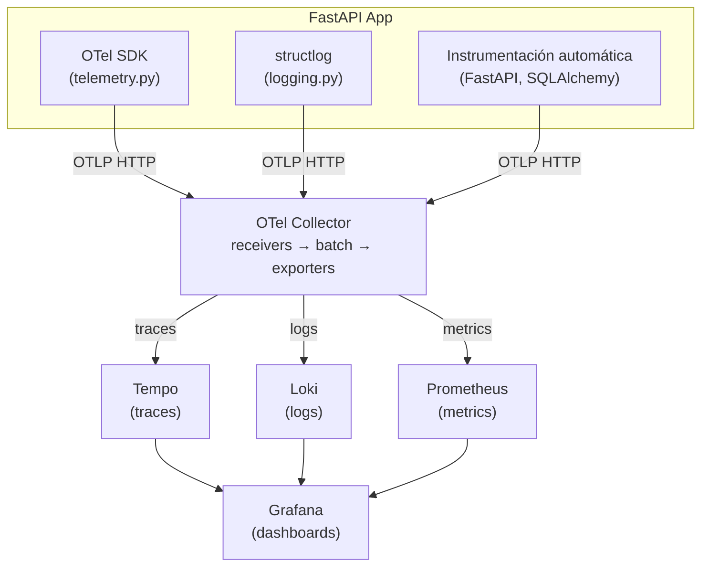

---

## OpenTelemetry (OTel) — El estándar

OpenTelemetry es un **estándar abierto** (proyecto de la CNCF) que define:

1. **Una API** — Interfaces para crear traces, metrics y logs
2. **Un SDK** — Implementación de esas interfaces (lo que instalás en tu app)
3. **Un protocolo** — OTLP (OpenTelemetry Protocol), el formato de transporte de datos
4. **Un collector** — Proceso que recibe, procesa y reenvía datos de telemetría

### Por qué existe

Antes de OTel, cada vendor (Datadog, New Relic, Jaeger, Zipkin) tenía su propia librería de instrumentación. Si querías cambiar de Datadog a Grafana, tenías que reescribir toda la instrumentación.

OTel resuelve esto: instrumentás una vez, y mandás los datos a donde quieras. Solo cambiás el **exporter** (la URL de destino).

### Los componentes del SDK

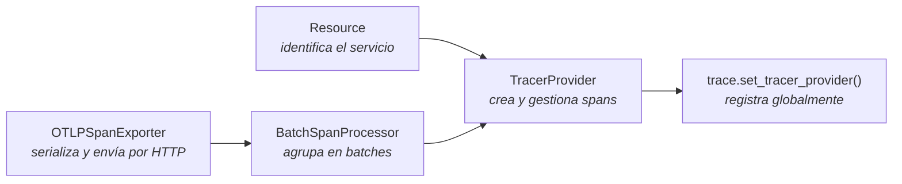

En código:

```python
resource = Resource.create({SERVICE_NAME: "fastapi-template"})
tracer_provider = TracerProvider(resource=resource)
exporter = OTLPSpanExporter(endpoint="http://collector:4318/v1/traces")
tracer_provider.add_span_processor(BatchSpanProcessor(exporter))
trace.set_tracer_provider(tracer_provider)
```

### Instrumentación automática vs manual

**Automática** — Instalás una librería y se instrumenta sola:
```python
FastAPIInstrumentor().instrument()       # crea spans por cada request HTTP
SQLAlchemyInstrumentor().instrument()    # crea spans por cada query SQL
```

Estas librerías usan monkey-patching: interceptan las funciones internas de FastAPI/SQLAlchemy y les agregan código de tracing sin que vos toques nada.

**Manual** — Vos creás spans custom para medir lógica de negocio:
```python
tracer = trace.get_tracer(__name__)

with tracer.start_as_current_span("verify_password") as span:
    span.set_attribute("user.email", email)
    result = bcrypt.verify(password, hash)
```

En este proyecto solo usamos automática, que cubre el 90% de los casos.

---

## Los tres pilares por dentro

### Traces

Un **trace** es el recorrido completo de un request. Está compuesto de **spans** (segmentos de tiempo).

```mermaid
gantt
    title Trace: POST /api/v1/auth/login (trace_id: abc123...)
    dateFormat x
    axisFormat %L ms

    section HTTP
    POST /api/v1/auth/login           :0, 150

    section Database
    SELECT users WHERE email=         :5, 20
    SELECT roles, permissions         :22, 35

    section Response
    Enviar respuesta HTTP             :140, 150
```

Cada span tiene:
- **trace_id** — identifica todo el trace (compartido por todos los spans)
- **span_id** — identifica este span en particular
- **parent_span_id** — quién lo creó (forma el árbol)
- **operation name** — qué operación representa
- **start/end time** — cuándo empezó y terminó
- **attributes** — metadata (`http.method`, `db.statement`, etc.)
- **status** — OK o ERROR

El `trace_id` es un número de 128 bits generado al inicio del request. Se propaga por headers (`traceparent`) si hay servicios downstream.

### Metrics

Los metrics son **valores numéricos agregados** en el tiempo:

- **Counter** — Solo sube: total de requests, total de errores
- **Histogram** — Distribución: latencia (p50, p95, p99), tamaño de response
- **Gauge** — Sube y baja: conexiones activas, memoria usada

```
http_server_duration{method="POST", route="/api/v1/auth/login"}
  → bucket_100ms: 450 requests
  → bucket_500ms: 480 requests
  → bucket_1000ms: 495 requests
  → bucket_+Inf: 500 requests
```

De esto calculás: "el 90% de los requests de login tardan menos de 100ms" (p90 = 100ms).

La instrumentación de FastAPI crea estas metrics automáticamente.

### Logs

Texto estructurado de eventos. Con structlog + OTel quedan así:

```json
{
  "event": "request",
  "level": "info",
  "timestamp": "2026-03-23T16:23:04.328Z",
  "method": "POST",
  "path": "/api/v1/auth/login",
  "status": 200,
  "duration_ms": 45.2,
  "request_id": "550e8400-e29b-41d4-a716-446655440000",
  "trace_id": "1dc43d799acc3aeb664200ae6b4aa9ae",
  "span_id": "9a8b09b689770685"
}
```

El `trace_id` en el log es la clave — permite saltar del log al trace en Grafana.

---

## Qué pasa cuando llega un request

Paso a paso, un `POST /api/v1/auth/login`:

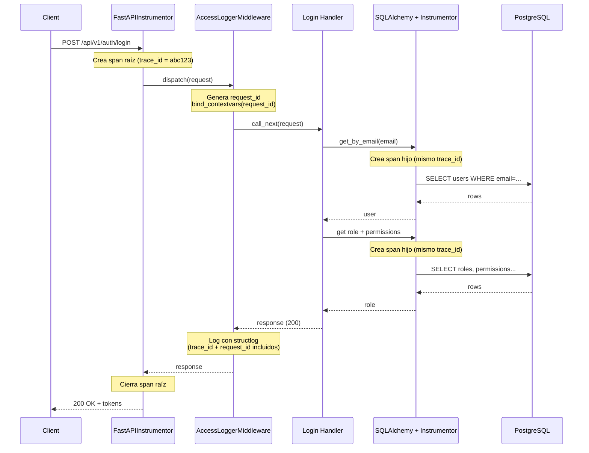

### 1. FastAPIInstrumentor intercepta el request

El instrumentor de FastAPI (que se registró al inicio) envuelve el handler con un middleware ASGI. Crea un **span raíz** con un nuevo `trace_id`:

```
Span creado:
  trace_id: 1dc43d799acc3aeb664200ae6b4aa9ae
  span_id: aaa111
  name: "POST /api/v1/auth/login"
  attributes: {http.method: "POST", http.route: "/api/v1/auth/login"}
```

Este span se guarda en un **context** (via Python contextvars), disponible para todo el código que se ejecute durante este request.

### 2. AccessLoggerMiddleware se ejecuta

Nuestro middleware genera un `request_id` y lo bindea a structlog via contextvars:

```python
structlog.contextvars.bind_contextvars(request_id=request_id)
```

### 3. El handler ejecuta la lógica

```python
user = await service.get_by_email(data.email)
```

### 4. SQLAlchemyInstrumentor intercepta la query

Cuando SQLAlchemy ejecuta el SELECT, el instrumentor crea un **span hijo**:

```
Span creado:
  trace_id: 1dc43d799acc3aeb664200ae6b4aa9ae  (mismo trace)
  span_id: bbb222
  parent_span_id: aaa111  (el span de FastAPI)
  name: "SELECT"
  attributes: {db.system: "postgresql", db.statement: "SELECT users..."}
```

### 5. structlog escribe un log

Cuando nuestro middleware loguea el request completado, `_add_otel_context` extrae el trace context:

```python
def _add_otel_context(logger, method, event_dict):
    span = trace.get_current_span()       # obtiene el span activo de contextvars
    ctx = span.get_span_context()
    event_dict["trace_id"] = format(ctx.trace_id, "032x")  # int → hex string
    event_dict["span_id"] = format(ctx.span_id, "016x")
    return event_dict
```

El log se escribe con `trace_id` y `span_id` incluidos.

### 6. Los datos se exportan

Todo esto pasa en memoria. En background:

- **BatchSpanProcessor** acumula spans y cada 5 segundos los serializa a OTLP protobuf y hace un HTTP POST a `http://otel-collector:4318/v1/traces`
- **PeriodicExportingMetricReader** cada 15 segundos exporta metrics a `/v1/metrics`
- **BatchLogRecordProcessor** acumula log records y los manda a `/v1/logs`

Los batches son importantes para performance — no querés hacer un HTTP POST por cada span.

---

## Nuestro código — telemetry.py

```
app/core/telemetry.py
```

Este archivo configura todo el SDK de OTel. Se ejecuta una vez al inicio de la app.

```python
def setup_telemetry() -> None:
    if not settings.OTEL_ENABLED:
        return  # No-op si está deshabilitado — zero overhead
```

### Resource

```python
resource = Resource.create({SERVICE_NAME: settings.OTEL_SERVICE_NAME})
```

Un `Resource` identifica **de dónde vienen** los datos. Todos los traces, metrics y logs de este proceso van a tener `service.name = "fastapi-template"`. Esto es lo que ves en Grafana como label.

### TracerProvider + Sampler

```python
tracer_provider = TracerProvider(
    resource=resource,
    sampler=TraceIdRatioBased(settings.OTEL_TRACES_SAMPLE_RATE),
)
```

El **sampler** decide qué traces se registran. Con `rate=1.0` se capturan todos. Con `rate=0.1` se captura el 10% (para producción con mucho tráfico). La decisión se toma al inicio del trace basándose en el `trace_id` — es determinística, así que si un servicio samplea un trace, todos los servicios downstream también lo hacen.

### BatchSpanProcessor + Exporter

```python
tracer_provider.add_span_processor(
    BatchSpanProcessor(OTLPSpanExporter(endpoint=f"{endpoint}/v1/traces"))
)
```

- **OTLPSpanExporter** — Serializa spans a protobuf y los manda por HTTP
- **BatchSpanProcessor** — Los acumula en un buffer y los envía en batch (default: cada 5s o cuando hay 512 spans). Si el collector no responde, descarta los datos (no querés que la observabilidad rompa tu app)

### MeterProvider

```python
metric_reader = PeriodicExportingMetricReader(
    OTLPMetricExporter(endpoint=f"{endpoint}/v1/metrics"),
    export_interval_millis=15000,
)
metrics.set_meter_provider(MeterProvider(resource=resource, metric_readers=[metric_reader]))
```

Similar a traces pero con un reader periódico. Cada 15 segundos lee todas las metrics acumuladas y las exporta.

### LoggerProvider

```python
logger_provider = LoggerProvider(resource=resource)
logger_provider.add_log_record_processor(
    BatchLogRecordProcessor(OTLPLogExporter(endpoint=f"{endpoint}/v1/logs"))
)
logging.getLogger().addHandler(LoggingHandler(logger_provider=logger_provider))
```

Este es el bridge entre Python stdlib logging y OTel. `LoggingHandler` es un `logging.Handler` que convierte cada `LogRecord` de Python en un `LogRecord` de OTel y lo manda al collector. Como structlog está configurado para usar `stdlib.LoggerFactory()`, todos los logs de structlog pasan por acá.

### Instrumentación

```python
FastAPIInstrumentor().instrument(excluded_urls="health")
SQLAlchemyInstrumentor().instrument(engine=engine.sync_engine)
```

`.instrument()` hace monkey-patching interno. Por ejemplo, `FastAPIInstrumentor` reemplaza el middleware ASGI de Starlette para envolver cada request en un span. `SQLAlchemyInstrumentor` registra event listeners en SQLAlchemy (`before_cursor_execute`, `after_cursor_execute`) para crear spans por cada query.

`excluded_urls="health"` evita crear traces para el healthcheck (que se ejecuta constantemente y llenaría Tempo de ruido).

---

## Nuestro código — logging.py

```
app/core/logging.py
```

### El bridge structlog → stdlib → OTel

El flujo de un log:

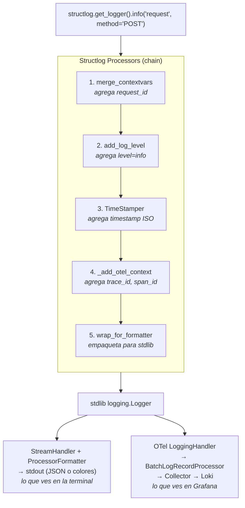

### _add_otel_context — El procesador clave

```python
def _add_otel_context(logger, method, event_dict):
    span = trace.get_current_span()
    ctx = span.get_span_context()
    if ctx and ctx.trace_id:
        event_dict["trace_id"] = format(ctx.trace_id, "032x")
        event_dict["span_id"] = format(ctx.span_id, "016x")
    return event_dict
```

`trace.get_current_span()` usa Python `contextvars` internamente. Cuando FastAPIInstrumentor crea un span al inicio del request, lo guarda en el contexto. Cualquier código que corra dentro de ese request (nuestro middleware, services, etc.) puede acceder a ese span.

`format(ctx.trace_id, "032x")` convierte el int de 128 bits a un hex string de 32 caracteres, que es el formato estándar que Tempo y Grafana esperan.

---

## OTel Collector — El router de datos

```
observability/otel-collector.yml
```

El Collector es un proceso standalone que actúa como intermediario. Recibe datos de tu app y los distribuye a los backends.

### Por qué no mandar directo a Tempo/Loki/Prometheus?

1. **Desacoplamiento** — Tu app solo conoce una URL. Si cambiás de Tempo a Jaeger, solo tocás el Collector
2. **Batching y retry** — El Collector maneja reintentos si un backend está caído
3. **Procesamiento** — Podés filtrar, samplear, o enriquecer datos antes de guardarlos
4. **Fan-out** — Mandás traces a Tempo Y a Datadog al mismo tiempo si querés

### Pipeline del Collector

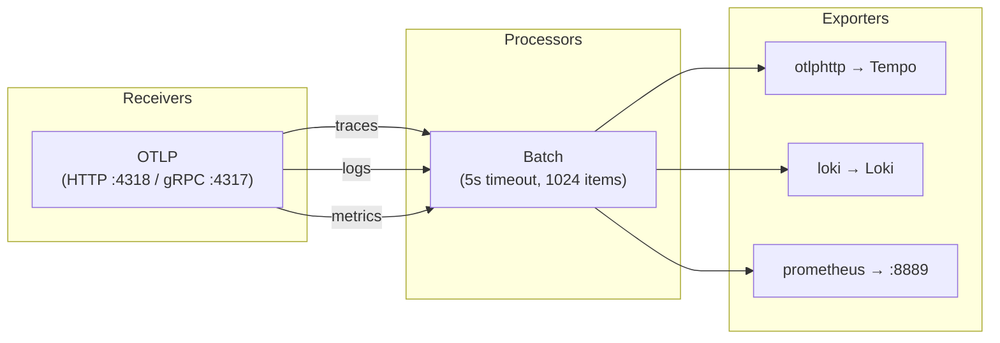

### La configuración

```yaml
receivers:          # ¿De dónde recibo datos?
  otlp:
    protocols:
      http:
        endpoint: 0.0.0.0:4318

processors:         # ¿Qué hago con los datos?
  batch:
    timeout: 5s
    send_batch_size: 1024

exporters:          # ¿A dónde los mando?
  otlphttp/tempo:
    endpoint: http://tempo:4318
  loki:
    endpoint: http://loki:3100/loki/api/v1/push
  prometheus:
    endpoint: 0.0.0.0:8889

service:            # ¿Cómo conecto todo?
  pipelines:
    traces:
      receivers: [otlp]
      processors: [batch]
      exporters: [otlphttp/tempo]
    logs:
      receivers: [otlp]
      processors: [batch]
      exporters: [loki]
    metrics:
      receivers: [otlp]
      processors: [batch]
      exporters: [prometheus]
```

Cada **pipeline** define: de dónde vienen los datos → qué procesamiento → a dónde van. Cada tipo de señal (traces, logs, metrics) tiene su propio pipeline.

El exporter de Prometheus funciona diferente: en vez de hacer push, expone un endpoint HTTP (`:8889`) que Prometheus scrapea periódicamente (pull model).

---

## Los backends de storage

### Tempo (traces)

Tempo es una base de datos optimizada para traces. Almacena spans indexados por `trace_id`.

- **Recibe** traces via OTLP del Collector
- **Almacena** en disco local (en producción usarías S3/GCS)
- **Consulta** por `trace_id` o usando TraceQL (lenguaje de query tipo SQL para traces)

Tempo es muy eficiente porque **no indexa** los atributos de los spans (a diferencia de Jaeger). Solo indexa el `trace_id`. Esto lo hace barato de operar pero requiere que llegues al trace por otro medio (logs o metrics).

### Loki (logs)

Loki es como "Prometheus pero para logs". Almacena logs indexados por **labels**, no por contenido.

- **Recibe** logs del Collector via su API HTTP
- **Indexa** solo los labels (`service_name`, `level`, etc.), NO el texto del log
- **Almacena** el texto comprimido en chunks

Esto es lo que lo hace escalable: indexar texto completo (como Elasticsearch) es caro. Loki indexa poco y comprime mucho.

Query en LogQL:
```
{service_name="fastapi-template", level="error"} | json | duration_ms > 1000
```

- `{service_name="..."}` → filtra por labels (usa el índice, rápido)
- `| json` → parsea el contenido del log como JSON
- `| duration_ms > 1000` → filtra por campo del JSON (escanea el texto, más lento)

### Prometheus (metrics)

Prometheus es una base de datos de series temporales (TSDB).

- **Scrapea** el endpoint `/metrics` del Collector cada 15 segundos (pull model)
- **Almacena** como series temporales: `metric_name{labels} value timestamp`
- **Consulta** con PromQL

A diferencia de Tempo y Loki que reciben datos por push (el collector les envía), Prometheus los busca activamente (pull). El Collector expone las metrics en formato Prometheus en el puerto 8889, y Prometheus las scrapea.

```yaml
# observability/prometheus.yml
scrape_configs:
  - job_name: otel-collector
    static_configs:
      - targets: ["otel-collector:8889"]
```

---

## Grafana — La capa de visualización

Grafana no almacena datos. Es un frontend que consulta a los backends y renderiza dashboards.

### Datasources

```
observability/grafana/datasources.yml
```

Este archivo se monta en el container de Grafana y provisiona los datasources automáticamente al iniciar:

- **Prometheus** → `http://prometheus:9090` — para metrics
- **Tempo** → `http://tempo:3200` — para traces
- **Loki** → `http://loki:3100` — para logs

### La magia: correlación entre datasources

El datasource de Tempo tiene configurado:

```yaml
tracesToLogsV2:
  datasourceUid: loki
  filterByTraceID: true
  query: '{service_name="..."} | json | trace_id = `${__span.traceId}`'
```

Esto le dice a Grafana: "cuando estés mirando un trace, podés buscar los logs relacionados en Loki filtrando por trace_id". Aparece como un botón "Logs for this span".

El datasource de Loki tiene configurado:

```yaml
derivedFields:
  - datasourceUid: tempo
    matcherRegex: '"trace_id":"(\w+)"'
    name: TraceID
    url: "$${__value.raw}"
    urlDisplayLabel: View Trace
```

Esto le dice a Grafana: "cuando veas un log que tenga un campo `trace_id`, creá un link clickeable a Tempo". Aparece como "View Trace" al lado de cada log.

---

## Correlación entre pilares

La correlación es lo que hace que la observabilidad sea más que la suma de sus partes.

### El hilo conductor: trace_id

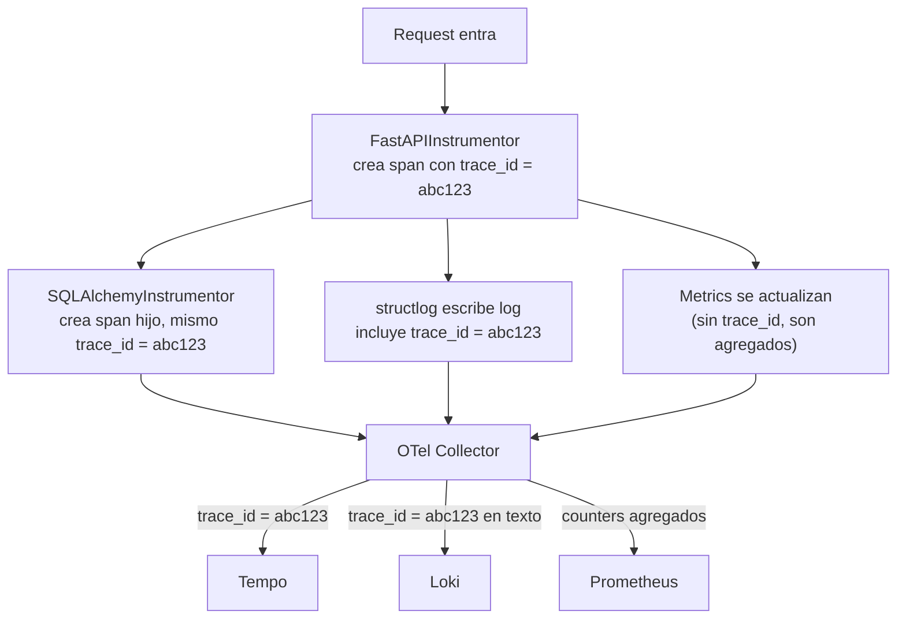

### Flujo de debugging en Grafana

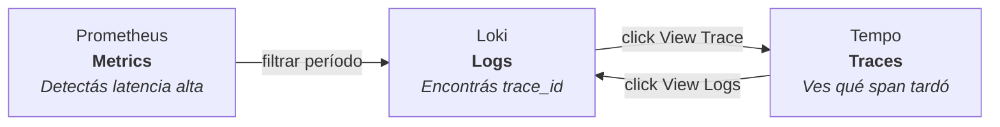

---

## Producción vs desarrollo local

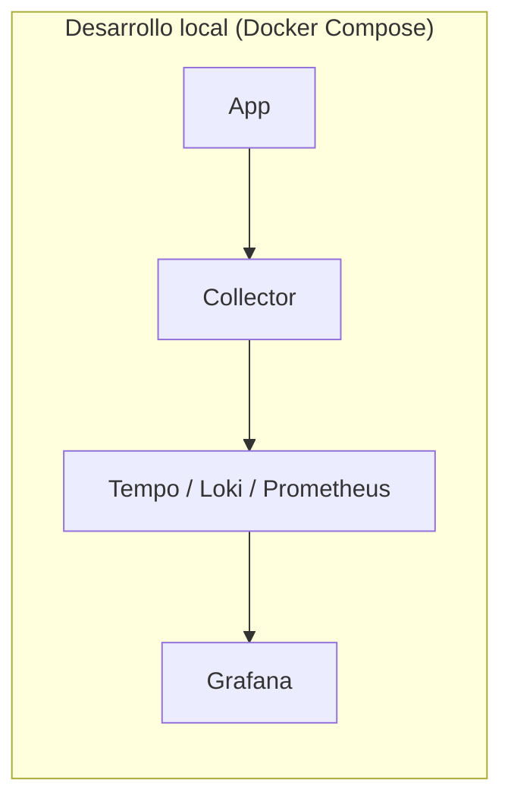

`OTEL_EXPORTER_OTLP_ENDPOINT=http://otel-collector:4318`

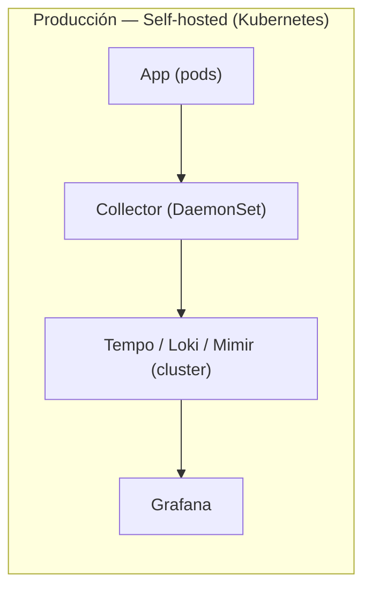

Misma arquitectura, pero cada componente corre en su propio deployment con storage persistente (S3/GCS).

`OTEL_EXPORTER_OTLP_ENDPOINT=http://otel-collector.monitoring.svc:4318`

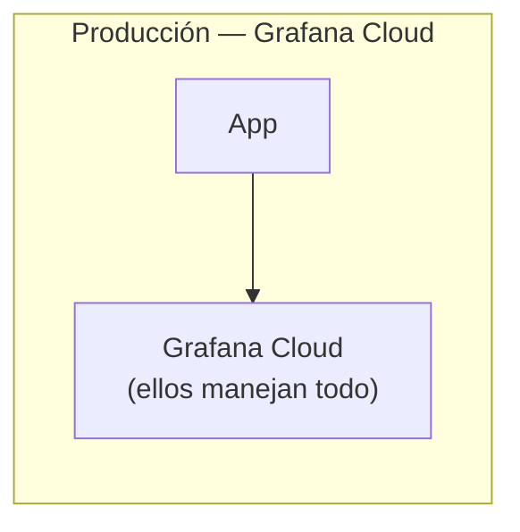

No necesitás Collector ni backends. Solo cambiás la URL y agregás un API key:

`OTEL_EXPORTER_OTLP_ENDPOINT=https://otlp-gateway-prod-us-east-0.grafana.net/otlp`

### Lo que NO cambia

Tu código (`telemetry.py`, `logging.py`) es **exactamente el mismo** en los tres escenarios. Solo cambiás variables de entorno. Esa es la gracia de OTel.
